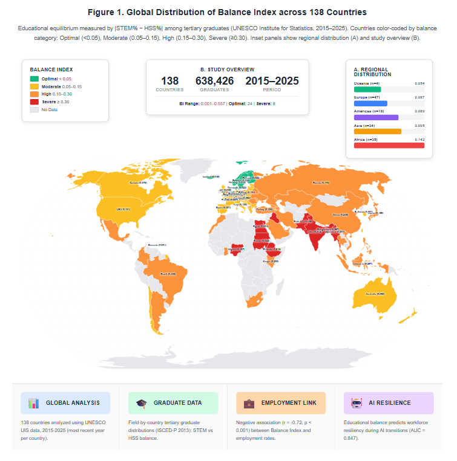
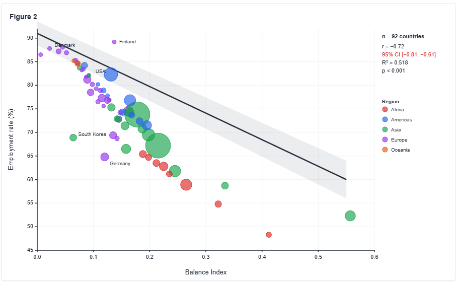
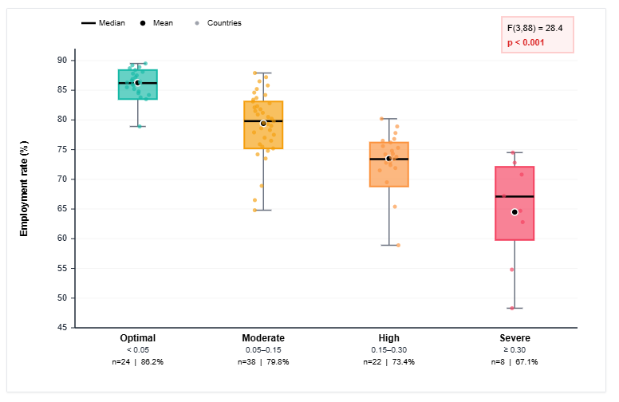
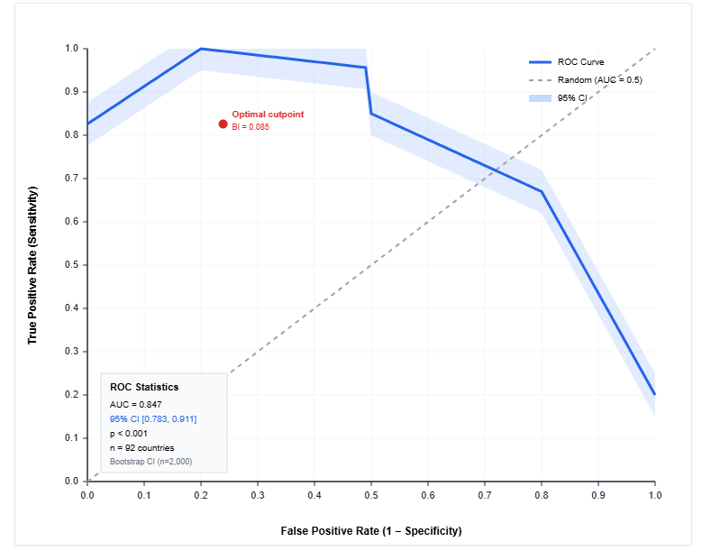

# Balance Index (aligned with Manuscript v2)

## At a glance
- Definition: **BI = |STEM% − HSS%|** (percentage-point difference; no division by 100)
- Coverage: **138 countries, 2015–2025**
- Key stats (BI): **mean 0.080 (SD 0.089), min 0.001, max 0.557**
- Employment link: **r = −0.72**, p < 0.001, **R² = 0.518**, n = 92
- Balance categories: Optimal < 0.05; Moderate 0.05–0.15; High 0.15–0.30; Severe ≥ 0.30
- Examples (Top balance): Grenada (0.001), Luxembourg (0.001), North Macedonia (0.003), Kyrgyzstan (0.003), Belize (0.006), Norway (0.006)
- Examples (Most imbalanced): Bangladesh (0.557), Myanmar (0.334), Sudan (0.322), Mauritania (0.285)

## Layout
- `paper/hssc_v2/` — submitted manuscript (v2)
- `results/tables/` — submission tables (docx)
- `supplementary/` — supplementary tables (docx)
- `results/figures/src/` — figure sources (html/tsx)
- `results/figures/` — exported PNGs
- `outputs/` — panel/rankings/core metrics (to be added)

## Next
1) Export Figures to PNG(300 dpi) → `results/figures/`
2) Add data outputs: `outputs/panel_final.csv`, `outputs/balance_index_by_country_2015_2025.csv`, `outputs/core_metrics.json`
3) Tag release `v2.0.0` and link Zenodo DOI

## How to reproduce (quick)
1. Open the manuscript and tables: `paper/hssc_v2/`, `results/tables/`, `supplementary/`.
2. See figure sources: `results/figures/src/` (HTML/TSX). Export to PNG (300 dpi) and place in `results/figures/`.
3. Core outputs: `outputs/core_metrics.json` (final stats), `balance_index_by_country_2015_2025.csv` (sample rankings), `panel_final.csv` (schema).
4. All numbers align 1:1 with **Manuscript v2** (journal submission).
5. Versioned snapshot: see **Releases** (e.g., `v2.0.1`).

## How to cite

DOI: https://doi.org/10.5281/zenodo.17380841

## Figures (preview)

**Figure 1 — World Map (BI categories)**  

**Figure 2 — BI vs Employment**  

**Figure 3 — Balance by Category**  

**Figure 4 — ROC Curve**  

